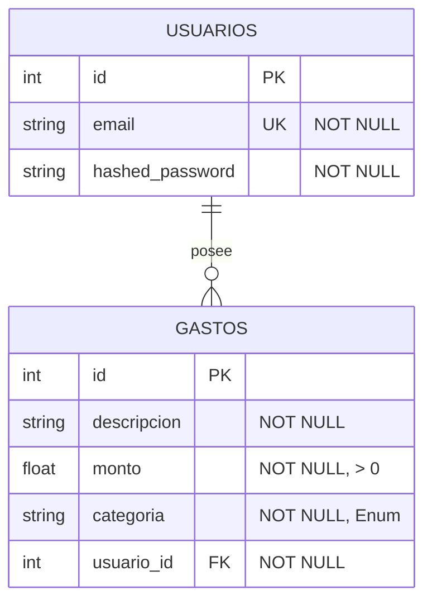

# Data Model: Sistema de Control de Gastos Personales

**Feature**: [`specs/001-control-gastos/spec.md`](../spec.md)  
**Date**: 2026-09-15  
**Status**: Completed

Este documento describe el modelo de datos relacional y las definiciones de schemas de transferencia (Pydantic) de la aplicación, alineados con los **Artículos I, III, IV y V** de la Constitución del Proyecto.

---

## 1. Diagrama Entidad-Relación



---

## 2. Modelos Relacionales (SQLAlchemy 2.0)

### 2.1 Modelo `Usuario` (`app/models/usuario.py`)

- **Tabla**: `usuarios`
- **Campos**:
  - `id`: `Integer`, Primary Key, autoincremental (`index=True`).
  - `email`: `String(255)`, único (`unique=True`), indexado (`index=True`), obligatorio (`nullable=False`).
  - `hashed_password`: `String(255)`, obligatorio (`nullable=False`). Almacena la cadena bcrypt (60 caracteres).
- **Relaciones**:
  - `gastos`: Relación uno-a-muchos hacia `Gasto` (`back_populates="usuario"`, `cascade="all, delete-orphan"`).
- **Reglas constitucionales**:
  - **Artículo IV.1**: La contraseña en texto plano NUNCA se persiste en este modelo; solo `hashed_password`.
  - **Artículo VIII.1**: El constructor soporta inicialización posicional o por palabra clave `Usuario(id=..., email=..., hashed_password=...)` según lo demandan los tests de referencia de las Sesiones 6-8.

### 2.2 Modelo `Gasto` (`app/models/gasto.py`)

- **Tabla**: `gastos`
- **Campos**:
  - `id`: `Integer`, Primary Key, autoincremental (`index=True`).
  - `descripcion`: `String(255)`, obligatorio (`nullable=False`).
  - `monto`: `Float`, obligatorio (`nullable=False`). Restringido en base de datos o aplicación a valores estrictamente positivos (`CheckConstraint('monto > 0')`).
  - `categoria`: `String(50)`, obligatorio (`nullable=False`), indexado (`index=True`).
  - `usuario_id`: `Integer`, Foreign Key referenciando a `usuarios.id` (`ondelete="CASCADE"`), obligatorio (`nullable=False`), indexado (`index=True`).
- **Relaciones**:
  - `usuario`: Relación muchos-a-uno hacia `Usuario` (`back_populates="gastos"`).
- **Reglas constitucionales**:
  - **Artículo III.3**: Todo registro de gasto incluye de forma obligatoria `usuario_id` como clave foránea. Ninguna consulta u operación puede omitir este filtro.

---

## 3. Enumeraciones y Constantes de Dominio

### 3.1 `CategoriaGasto` (`app/models/enums.py` o `app/services/gastos.py`)

Enum de categorías válidas según requerimiento de negocio y Artículo II.2:
```python
from enum import Enum

class CategoriaGasto(str, Enum):
    COMIDA = "comida"
    TRANSPORTE = "transporte"
    ENTRETENIMIENTO = "entretenimiento"
    OTROS = "otros"

CATEGORIAS_VALIDAS = {c.value for c in CategoriaGasto}
```

### 3.2 Constante de Límite de Gasto

Constante requerida contractualmente por el **Artículo VIII.1**:
```python
LIMITE_POR_CATEGORIA: float = 500.0
```

---

## 4. Esquemas de Datos Pydantic v2 (`app/schemas/`)

Conforme al **Artículo V.3**, los esquemas de entrada y salida son estrictamente independientes para evitar exponer detalles internos de persistencia.

### 4.1 Esquemas de Usuario (`app/schemas/usuario.py`)

- **`UsuarioCreate`** (Entrada):
  - `email`: `EmailStr` (valida formato con `email-validator`).
  - `password`: `str` con longitud mínima (`min_length=6`).
- **`UsuarioOut`** (Salida):
  - `id`: `int`.
  - `email`: `EmailStr`.
  - Configuración: `model_config = ConfigDict(from_attributes=True)`.
  - *Nota*: No contiene `password` ni `hashed_password` (Artículo IV.1).
- **`Token`** (Respuesta de autenticación):
  - `access_token`: `str`.
  - `token_type`: `str = "bearer"`.

### 4.2 Esquemas de Gasto (`app/schemas/gasto.py`)

- **`GastoCreate`** (Entrada):
  - `descripcion`: `str` (`min_length=1`). Debe validarse que no esté vacía tras aplicar `.strip()`.
  - `monto`: `float` (`gt=0`). Restringe estrictamente a valores mayores a 0.0.
  - `categoria`: `str` o `CategoriaGasto`.
- **`GastoOut`** (Salida):
  - `id`: `int`.
  - `descripcion`: `str`.
  - `monto`: `float`.
  - `categoria`: `str`.
  - `usuario_id`: `int`.
  - Configuración: `model_config = ConfigDict(from_attributes=True)`.

---

## 5. Reglas de Validación y Límites de Dominio

1. **Monto Positivo**:
   - `monto > 0.0`. Valores `<= 0.0` se rechazan con error de validación `422 Unprocessable Entity` en la capa de routers o `ValueError` en services.
2. **Descripción No Vacía**:
   - `descripcion.strip() != ""` es obligatoria.
3. **Categoría Válida**:
   - Debe pertenecer exactamente a `{"comida", "transporte", "entretenimiento", "otros"}`. Si no pertenece, `services/gastos.py` lanza `CategoriaInvalidaError` (mapeado a `HTTP 400`).
4. **Límite Acumulado por Categoría**:
   - Condición: `acumulado_actual + nuevo_monto <= 500.0`.
   - Si `acumulado_actual + nuevo_monto == 500.0`: **PERMITIDO** (`HTTP 201`).
   - Si `acumulado_actual + nuevo_monto > 500.0`: **RECHAZADO** con `LimiteExcedidoError` (`HTTP 400`).
5. **Aislamiento por Usuario**:
   - Cualquier cálculo de acumulado o consulta de registros ejecuta:
     ```sql
     SELECT ... FROM gastos WHERE usuario_id = :usuario_id AND categoria = :categoria
     ```
   - El valor de `:usuario_id` procede exclusivamente de la sesión autenticada.
