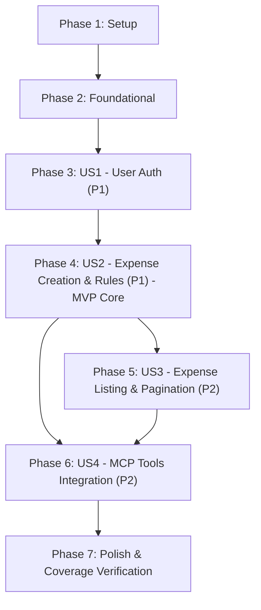

# Tasks: Sistema de Control de Gastos Personales

**Input**: Design documents from [`specs/001-control-gastos/`](.)  
**Prerequisites**: [plan.md](plan.md), [spec.md](spec.md), [data-model.md](data-model.md), [contracts/](contracts/), [research.md](research.md), [quickstart.md](quickstart.md), [constitution.md](../../.specify/memory/constitution.md)

**Tests**: Included as required by the project constitution (Article VII: Pirámide de pruebas, 100% cobertura de reglas de negocio, umbrales de cobertura obligatorios y preservación inalterable de la suite de pruebas de las Sesiones 6-8).

**Organization**: Tasks are grouped by user story to enable independent implementation and testing of each story increment.

## Format: `[ID] [P?] [Story] Description with file path`

- **[P]**: Can run in parallel (different files, no dependencies)
- **[Story]**: Which user story this task belongs to (`[US1]`, `[US2]`, `[US3]`, `[US4]`)
- Every task includes explicit file paths and constraint details

---

## Phase 1: Setup (Shared Infrastructure)

**Purpose**: Project initialization, directory structure, dependency definitions, and compatibility groundwork.

- [ ] T001 Create project directory structure for packages `app/core/`, `app/models/`, `app/schemas/`, `app/repositories/`, `app/services/`, `app/routers/`, `app/utils/`, `app/mcp/tools/`, `tests/`, and `alembic/versions/` per `specs/001-control-gastos/plan.md`
- [ ] T002 [P] Create `pyproject.toml` declaring dependencies (`fastapi`, `uvicorn[standard]`, `sqlalchemy>=2.0`, `alembic`, `pyjwt`, `passlib[bcrypt]`, `bcrypt<4.1`, `pydantic-settings`, `email-validator`, `python-multipart`, `mcp`, `pytest`, `pytest-cov`, `httpx`) and configuring coverage exclusions in `[tool.coverage.run] omit` (`main.py`, `mcp/server.py`, `mcp/auth.py`, `logging_config.py`) per Constitution Article VII.3
- [ ] T003 [P] Create `.env.example` in repository root documenting configuration variables `SECRET_KEY`, `DATABASE_URL=sqlite:///./gastos.db`, `ACCESS_TOKEN_EXPIRE_MINUTES=60`, and `DEMO_USER_EMAIL=demo@gastos.local` per Constitution Article IV.3
- [ ] T004 [P] Create `tests/__init__.py` to enable package-level test imports (`from tests.test_gastos import RepositorioFalso`) as mandated by Constitution Article VIII.1

---

## Phase 2: Foundational (Blocking Prerequisites)

**Purpose**: Core infrastructure that MUST be complete before ANY user story can be implemented.

**⚠️ CRITICAL**: No user story work can begin until this phase is complete.

- [ ] T005 Implement environment settings management in `app/core/config.py` using `pydantic_settings.BaseSettings` reading `SECRET_KEY`, `DATABASE_URL`, `ACCESS_TOKEN_EXPIRE_MINUTES`, and `DEMO_USER_EMAIL` from `.env`
- [ ] T006 [P] Implement password hashing and JWT utility functions in `app/core/security.py` using `passlib.context.CryptContext(schemes=["bcrypt"])` and `pyjwt` (HS256) per Constitution Article IV.1 and IV.2
- [ ] T007 [P] Implement SQLAlchemy database engine, session factory, `Base` declarative class, and `get_db` generator dependency in `app/database.py` with SQLite conditional `connect_args={"check_same_thread": False}` per Constitution Article III.2
- [ ] T008 [P] Define `CategoriaGasto` Enum with values `"comida"`, `"transporte"`, `"entretenimiento"`, `"otros"` and `CATEGORIAS_VALIDAS` set in `app/models/enums.py` per `specs/001-control-gastos/data-model.md`
- [ ] T009 [P] Implement pure helper utility functions in `app/utils/helpers.py` without importing services, routers, or repositories per Constitution Article I.4
- [ ] T010 Setup Alembic migration environment in `alembic.ini` and `alembic/env.py` configured to target `app.database.Base.metadata`
- [ ] T011 [P] Create shared test fixtures in `tests/conftest.py` providing an isolated in-memory SQLite database session (`sqlite:///:memory:`) and FastAPI `TestClient` per Constitution Article VII.4

**Checkpoint**: Foundation ready — user story implementation can now begin.

---

## Phase 3: User Story 1 - Registro y Autenticación de Usuario (Priority: P1)

**Goal**: Permitir a nuevos usuarios registrarse con email único y contraseña hasheada, e iniciar sesión mediante OAuth2 Password Flow recibiendo un token JWT firmado.

**Independent Test**: Registrar una cuenta en `POST /usuarios/`, verificar que la contraseña nunca se expone y que emails duplicados retornan `400 Bad Request`; solicitar un token en `POST /usuarios/token` con credenciales válidas y verificar el retorno de un token JWT con `200 OK`.

### Tests for User Story 1

- [ ] T012 [P] [US1] Create unit and API test suite in `tests/test_usuarios.py` covering user creation, password hashing verification, duplicate email rejection (400), token issuance (200), and invalid credentials rejection (401)

### Implementation for User Story 1

- [ ] T013 [P] [US1] Implement `Usuario` SQLAlchemy model in `app/models/usuario.py` with fields `id` (PK), `email` (String 255, unique, index, not null), `hashed_password` (String 255, not null), and constructor supporting `Usuario(id=, email=, hashed_password=)` per Constitution Article VIII.1
- [ ] T014 [P] [US1] Implement Pydantic schemas in `app/schemas/usuario.py` for `UsuarioCreate` (`email: EmailStr`, `password: str min_length=6`), `UsuarioOut` (`id: int`, `email: EmailStr`), and `Token` (`access_token: str`, `token_type: str`) per `specs/001-control-gastos/contracts/rest-api.md`
- [ ] T015 [US1] Implement functional user repository in `app/repositories/usuarios.py` with functions `obtener_por_email(db, email: str) -> Usuario | None` and `guardar(db, email: str, hashed_password: str) -> Usuario` per Constitution Article VIII.1
- [ ] T016 [US1] Implement authentication dependency `get_current_user` in `app/dependencies.py` decoding JWT with `pyjwt`, extracting `sub` claim as email, and retrieving `Usuario` from repository (raising 401 if missing or invalid) per Constitution Article IV.4
- [ ] T017 [US1] Implement user router in `app/routers/usuarios.py` exposing `POST /usuarios/` (status 201, returning `UsuarioOut`) and `POST /usuarios/token` (using `OAuth2PasswordRequestForm`, returning `Token`) per `specs/001-control-gastos/contracts/rest-api.md`

**Checkpoint**: User Story 1 is fully functional and testable independently.

---

## Phase 4: User Story 2 - Registro de Gastos con Reglas de Negocio (Priority: P1) 🎯 MVP Core

**Goal**: Permitir a usuarios autenticados registrar gastos individuales validando reglas de negocio (`monto > 0`, `descripcion` no vacía, `categoria` permitida, total acumulado de categoría `<= 500.0` con `500.0` exacto permitido y `> 500.0` rechazado), inyectando el repositorio por parámetro por defecto (DIP).

**Independent Test**: Ejecutar `tests/test_gastos.py` con `RepositorioFalso` (sin mocks) y `tests/test_api_gastos.py` con `dependency_overrides`, verificando que gastos válidos responden `201 Created`, categorías no autorizadas lanzan `CategoriaInvalidaError` (`400`), montos `<= 0` devuelven `422`, y gastos que harían superar `500.0` en la categoría lanzan `LimiteExcedidoError` (`400`).

### Tests for User Story 2

- [ ] T018 [P] [US2] Copy reference unit test suite `tests/test_gastos.py` from Sessions 6-8 defining `RepositorioFalso` in memory and testing 100% of business rules without `unittest.mock` per Constitution Article VII.2 and VIII.1
- [ ] T019 [P] [US2] Copy reference integration test suite `tests/test_integracion_gastos.py` from Sessions 6-8 verifying database transactions against real SQLite in-memory per Constitution Article VII.4 and VIII.1
- [ ] T020 [P] [US2] Copy reference API test suite `tests/test_api_gastos.py` from Sessions 6-8 verifying `POST /gastos/` endpoint behavior using `app.dependency_overrides` for `get_db`, `get_gastos_repo`, and `get_current_user` per Constitution Article VII.5 and VIII.1

### Implementation for User Story 2

- [ ] T021 [P] [US2] Implement `Gasto` SQLAlchemy model in `app/models/gasto.py` with fields `id` (PK), `descripcion` (String 255, not null), `monto` (Float, not null, check `monto > 0`), `categoria` (String 50, index, not null), and `usuario_id` (Integer, FK `usuarios.id`, index, not null) per `specs/001-control-gastos/data-model.md`
- [ ] T022 [P] [US2] Implement Pydantic schemas in `app/schemas/gasto.py` for `GastoCreate` (`descripcion: str min_length=1`, `monto: float gt=0`, `categoria: str`) and `GastoOut` (`id: int`, `descripcion: str`, `monto: float`, `categoria: str`, `usuario_id: int`) per `specs/001-control-gastos/data-model.md`
- [ ] T023 [US2] Implement functional expense repository in `app/repositories/gastos.py` (module with loose functions, NOT a class) implementing `guardar(db, usuario_id: int, descripcion: str, monto: float, categoria: str) -> dict` and `total_por_categoria(db, usuario_id: int, categoria: str) -> float` returning primitive dicts/floats per Constitution Article VIII.1 and VIII.2
- [ ] T024 [US2] Implement expense domain service in `app/services/gastos.py` declaring `LIMITE_POR_CATEGORIA = 500.0`, exceptions `CategoriaInvalidaError` and `LimiteExcedidoError`, and `registrar_gasto(db, usuario_id: int, descripcion: str, monto: float, categoria: str, repo=gastos_repository) -> dict` enforcing exact boundary condition (`total_acumulado + monto <= 500.0` is allowed; `> 500.0` raises `LimiteExcedidoError`) per Constitution Article II.3, VIII.1, and `specs/001-control-gastos/spec.md`
- [ ] T025 [US2] Implement `get_gastos_repo` dependency in `app/dependencies.py` returning `app.repositories.gastos` module for FastAPI router injection per Constitution Article VIII.1
- [ ] T026 [US2] Implement expense router in `app/routers/gastos.py` handling `POST /gastos/` (deriving `usuario_id` strictly from `get_current_user`, delegating to `services.gastos.registrar_gasto`, translating `CategoriaInvalidaError` and `LimiteExcedidoError` to HTTP 400 with detail message, returning status 201 with `GastoOut`) per `specs/001-control-gastos/contracts/rest-api.md`

**Checkpoint**: User Stories 1 and 2 are functional; the Core MVP operates and passes all reference tests.

---

## Phase 5: User Story 3 - Consulta y Listado de Gastos Propios Paginados (Priority: P2)

**Goal**: Permitir a los usuarios autenticados consultar la lista de sus propios gastos con soporte de paginación (`skip`, `limit`), garantizando aislamiento total entre usuarios e ignorando cualquier identificador externo.

**Independent Test**: Registrar gastos con dos usuarios diferentes y consultar `GET /gastos/?skip=0&limit=20` con cada token, validando que cada usuario recibe únicamente sus registros propios, que `skip` y `limit` funcionan correctamente, y que enviar un `usuario_id` externo por parámetro no altera el filtro.

### Tests for User Story 3

- [ ] T027 [P] [US3] Add unit and integration tests for `listar_gastos` pagination and user isolation in `tests/test_gastos.py` and `tests/test_integracion_gastos.py`
- [ ] T028 [P] [US3] Add API tests for `GET /gastos/` in `tests/test_api_gastos.py` verifying status 200, query params `skip` and `limit`, validation error 422 on negative skip, and strict user isolation ignoring external user ID params

### Implementation for User Story 3

- [ ] T029 [US3] Implement `listar(db, usuario_id: int, skip: int = 0, limit: int = 20) -> list[dict]` in `app/repositories/gastos.py` filtering strictly by `usuario_id` with `offset(skip).limit(limit)` returning a list of dicts per Constitution Article VIII.1
- [ ] T030 [US3] Implement `listar_gastos(db, usuario_id: int, skip: int = 0, limit: int = 20, repo=gastos_repository) -> list[dict]` in `app/services/gastos.py` with default DIP parameter per Constitution Article II.3 and VIII.1
- [ ] T031 [US3] Implement `GET /gastos/` endpoint in `app/routers/gastos.py` accepting query parameters `skip: int = 0 (ge=0)` and `limit: int = 20 (gt=0)`, resolving `usuario_id` from `get_current_user`, and returning `list[GastoOut]` per `specs/001-control-gastos/contracts/rest-api.md`

**Checkpoint**: User Stories 1, 2, and 3 are fully operational and testable independently.

---

## Phase 6: User Story 4 - Gestión de Gastos mediante Protocolo MCP (Priority: P2)

**Goal**: Exponer herramientas MCP `registrar_gasto` y `listar_gastos` mediante el SDK oficial `mcp` montado en FastAPI vía transporte `streamable-http`, reutilizando los servicios de dominio y capturando errores de negocio de forma estructurada.

**Independent Test**: Invocar las herramientas MCP usando el cliente de prueba MCP o SSE endpoint, verificando que `registrar_gasto` y `listar_gastos` retornan datos del usuario autenticado y que violaciones de límites o categorías devuelven `{"error": "..."}` sin interrumpir la sesión MCP.

### Tests for User Story 4

- [ ] T032 [P] [US4] Create MCP test suite in `tests/test_mcp_gastos.py` validating successful expense creation, list retrieval, structured error dictionaries on invalid category and limit exceeded, and identity resolution from token per Constitution Article VI and VII.6

### Implementation for User Story 4

- [ ] T033 [P] [US4] Implement MCP authentication helper in `app/mcp/auth.py` to extract and verify Bearer JWT token from `Authorization` header in `streamable-http` requests, with documented fallback to `DEMO_USER_EMAIL` for `stdio` transport per Constitution Article VI.4
- [ ] T034 [US4] Implement MCP tools in `app/mcp/tools/gastos.py` defining `registrar_gasto(descripcion: str, monto: float, categoria: str)` and `listar_gastos(skip: int = 0, limit: int = 20)` with actionable descriptions, delegating directly to `app/services/gastos.py` and capturing business exceptions into `{"error": str(e)}` per Constitution Article VI.1, VI.2, and VI.3
- [ ] T035 [US4] Implement MCP server configuration and ASGI app setup in `app/mcp/server.py` using the official `mcp` SDK to expose tools over `streamable-http` per `specs/001-control-gastos/contracts/mcp-tools.md`

**Checkpoint**: User Stories 1, 2, 3, and 4 are complete with functional parity between REST API and MCP interfaces.

---

## Phase 7: Polish & Cross-Cutting Concerns

**Purpose**: Application assembly, database migrations, global exception safety, validation runs, and mandatory test coverage enforcement.

- [ ] T036 Assemble FastAPI application in `app/main.py` configuring app lifespan, registering global exception handler for unhandled `Exception` returning status 500 with `{"detail": "Error interno del servidor"}` and logging detail internally per Constitution Article IV.5, including routers `usuarios.router` and `gastos.router`, and mounting the MCP server at `/mcp`
- [ ] T037 Generate initial Alembic migration script in `alembic/versions/001_initial_schema.py` creating tables `usuarios` and `gastos` with foreign key constraints, checks, and indexes per `specs/001-control-gastos/data-model.md`
- [ ] T038 Execute manual and automated end-to-end validation scenarios documented in `specs/001-control-gastos/quickstart.md`
- [ ] T039 Execute test suite with coverage report `pytest --cov=app --cov-report=term-missing` and verify that coverage meets Constitution Article VII.3 thresholds: 100% of business rules covered, ≥ 90% lines in `app/services/`, and ≥ 80% lines in `app/services/ + app/repositories/ + app/routers/ + app/utils/`

---

## Dependencies & Execution Order

### Phase Dependencies

- **Setup (Phase 1)**: No dependencies — can start immediately.
- **Foundational (Phase 2)**: Depends on Setup (Phase 1) — BLOCKS all user stories.
- **User Story 1 (Phase 3)**: Depends on Foundational (Phase 2). Establishes identity, authentication, and user persistence.
- **User Story 2 (Phase 4)**: Depends on Foundational (Phase 2) and User Story 1 (Phase 3) for `usuario_id` authentication. Implements core expense recording and business validation.
- **User Story 3 (Phase 5)**: Depends on User Story 2 (Phase 4). Extends repositories and services to support pagination and multi-record queries.
- **User Story 4 (Phase 6)**: Depends on User Stories 2 and 3 (Phases 4 & 5). Wraps domain services into MCP tools.
- **Polish (Phase 7)**: Depends on completion of all desired user stories (Phases 3-6).

### User Story Dependencies



### Within Each User Story

1. Test files copied/written first to verify initial state / failure before implementation
2. Models and schemas created before repository and service functions
3. Repositories implemented before services
4. Services implemented before router endpoints / MCP tools
5. Story verified with its independent test before proceeding to dependent stories

### Parallel Opportunities

- **Phase 1**: Tasks T002, T003, and T004 can run in parallel after T001 creates directories.
- **Phase 2**: Tasks T006, T007, T008, T009, and T011 can be worked on in parallel once T005 is defined.
- **Phase 3**: Models (T013) and schemas (T014) can be developed in parallel with test definitions (T012).
- **Phase 4**: Reference test suites (T018, T019, T020) can be copied in parallel. Model (T021) and schemas (T022) can be created in parallel.
- **Phase 5**: Tests (T027, T028) can run in parallel with repository/service extensions.
- **Phase 6**: Test suite (T032) and authentication helper (T033) can be developed in parallel.

---

## Parallel Example: User Story 2 (Core MVP)

```bash
# Copy and verify reference test suites in parallel:
Task: "T018 [P] [US2] Copy reference unit test suite tests/test_gastos.py"
Task: "T019 [P] [US2] Copy reference integration test suite tests/test_integracion_gastos.py"
Task: "T020 [P] [US2] Copy reference API test suite tests/test_api_gastos.py"

# Build data structures in parallel:
Task: "T021 [P] [US2] Implement Gasto SQLAlchemy model in app/models/gasto.py"
Task: "T022 [P] [US2] Implement Pydantic schemas in app/schemas/gasto.py"
```

---

## Implementation Strategy

### MVP First (Phases 1, 2, 3, and 4)

1. Complete Phase 1: Setup
2. Complete Phase 2: Foundational (prerequisites)
3. Complete Phase 3: User Story 1 (User registration & token generation)
4. Complete Phase 4: User Story 2 (Core expense creation with business validation and reference tests)
5. **STOP and VALIDATE**: Run `pytest tests/test_gastos.py tests/test_integracion_gastos.py tests/test_api_gastos.py` — MVP is fully verifiable!

### Incremental Delivery

1. **Increment 1 (MVP)**: Setup + Foundational + US1 + US2 → Full expense recording with business rules verified against Sessions 6-8 tests.
2. **Increment 2**: Add User Story 3 (Paginación y aislamiento de listado) → Complete personal ledger auditing.
3. **Increment 3**: Add User Story 4 (MCP server & tools) → Agentic interaction support over `streamable-http`.
4. **Increment 4**: Polish + Coverage Check → Final verification against Constitution thresholds (≥90% services, ≥80% global).

---

## Notes

- Every task strictly adheres to `- [ ] [TaskID] [P?] [Story?] Description with file path`.
- No tasks share files in conflict during parallel execution.
- Coverage threshold verification (T039) is a mandatory quality gate, not an optional step.
- The reference test contract from Sessions 6-8 is fully honored without modifying assertions.
